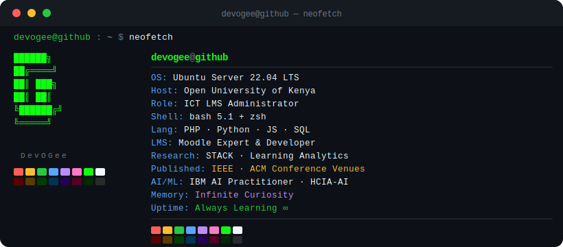
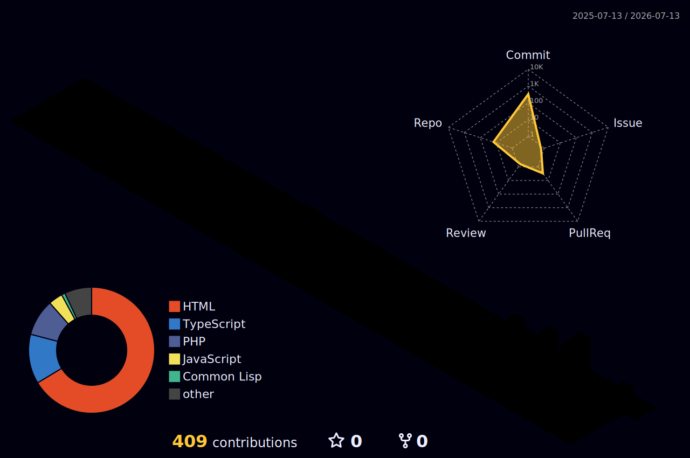

<!-- Capsule Render Header Banner -->

  

<!-- Original animation -->

  

---

### 🖥️ `$ neofetch`

  

---

# 👋 Hello, I'm DevOuma!

+Systems+Engineer+%7C+Computer+Scientist+and+Mathematical+Scientist+%7C+IT+Consultant" alt="Terminal Typing Effect" />

**Bridging mathematics and technology to create innovative solutions.**

I'm a Computer Scientist and Mathematical Scientist and IT Consultant with a strong passion for Open Source Software and DevOps. Currently pursuing an MSc in Computer Science, I specialize in developing robust IT solutions and infrastructure. With expertise in server administration, database management, and full-stack development, I bridge the gap between hardware and software to create efficient, scalable solutions.

[LinkedIn](https://www.linkedin.com/in/godfrey-godson) · [Email](mailto:gee.mwerevu@gmail.com)

---

### 🔎 State & Focus
- 📍 **Location:** Nairobi, Kenya
- 🔭 **Current Focus:** Pursuing an MSc in Computer Science. My work focuses on implementing modern technologies to solve real-world problems.
- ➗ **Research & Learning:** I'm particularly intrigued by the transformative potential of **STACK** (System for Teaching and Assessment using a Computer Algebra Kernel).
- 💡 **Status:** Open to collaboration on IT consulting, DevOps, and backend engineering projects.

---

### 🚀 About Me

I love turning complex mathematical logic into production-ready software. Holding a degree in Mathematics and Computer Science, I pair analytical problem solving with pragmatic engineering. My background spans:

- **Systems Engineering & DevOps:** Server administration, CI/CD, and robust IT infrastructure.
- **Backend & Database Management:** Designing high-performance, scalable databases and APIs.
- **LMS Architecture & E-Learning:** Advanced expertise in scalable Moodle administration, custom Moodle plugin development (PHP/JavaScript), and LMS systems integration.
- **Computer Algebra Assessment:** Leveraging maths to implement complex STACK environments for automated mathematics teaching and grading.

---

### 💻 `$ whoami`

  

---

### 💡 Quote of the Day

<!-- QUOTE_START -->
> *"Programs must be written for people to read, and only incidentally for machines to execute."*
>
> — **Harold Abelson**
<!-- QUOTE_END -->

> 🤖 *Auto-refreshed daily by GitHub Actions — [see the workflow](.github/workflows/update-readme.yml)*

---

### 🔧 Skills & Tech Stack

<!-- Skill Badges with Names -->

  
  
  
  
  
  
  
  
   
  
  
  
  
  
  
  

  
  
  
  

---

### 🏆 GitHub Trophies

  

---

### 🔥 GitHub Streak

  

---

###  GitHub Highlights

  
  

---

### 📊 Profile Summary Cards

  

  
  
  

---

### 📈 Contribution Activity Graph

  

### 🌟 3D Contribution Graph

  

### 🐍 Contribution Snake

  <picture>
    <source media="(prefers-color-scheme: dark)" srcset="https://raw.githubusercontent.com/DevOGee/DevOGee/output/github-contribution-grid-snake-dark.svg">
    <source media="(prefers-color-scheme: light)" srcset="https://raw.githubusercontent.com/DevOGee/DevOGee/output/github-contribution-grid-snake.svg">
    
  </picture>

---

### 😄 Dev Joke of the Day

  

---

### 🗺️ Visitor World Map

  

  

---

### 📬 Let's collaborate

If you have a product idea, need help with server management, or want to discuss the intersection of Mathematics and Computer Science—let's chat!

  
  
  

  

<!-- Capsule Render Footer -->

  

